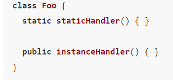
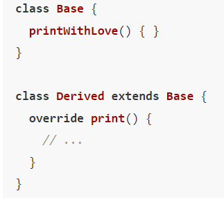
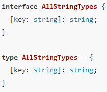
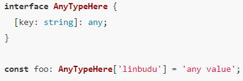
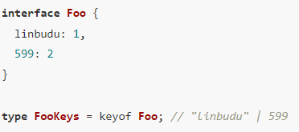
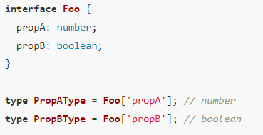
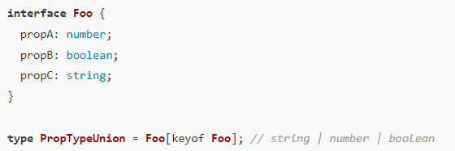
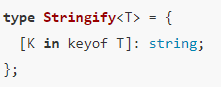
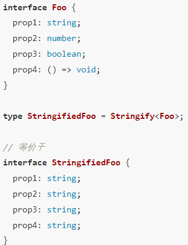

# Typescript

## 原始类型与对象类型

1. js中null表示这里有值但是是个空值，undefined表示这里没有值；而在ts中null和undefined都是有具体意义的值，在没有开启strictNullChecks检查的情况下，会被视作其他类型的子类型
2. ts中void用于描述一个内部没有return语句，或者没有显示return一个值的函数的返回值
3. 元组类型允许表示一个已知元素数量和类型的数组，各元素的类型不必相同。具名元组可以为元组元素打上类似属性的标记

   ```js
   const arr7: [name: string, age: number, male: boolean] = ['linbudu', 599, true];
   ```
4. 数组与元组的区别

   - 只能将整个数组/元组标记为只读，而不能像对象那样标记某个属性为只读
   - 一旦被标记为只读，则这个只读数组/元组的类型上，将不再具有push，pop等会修改原数组的方法
5. readonly关键字：防止对象的属性被再次赋值
6. 在ts中Object包含所有的数据类型；object代表所有非原始类型的类型（数组，对象，函数）；{}也包含所有类型，但是不能对这个变量进行任何赋值操作
7. 在js中symbol代表一个唯一的值的类型，类似于字符串类型，可以作为对象的属性名，但是在ts中，symbol类型指的都是ts中的同一个类型。在ts中支持了unique symbol这一类型声明，他是symbol类型的子类型，每一个unique symbol类型都是独一无二的。在ts中，如果想要引用已创建的unique symbol类型，则需要适用类型查询操作符typeof

   ```js
   declare const uniqueSymbolFoo: unique:symbol;
   const uniqueSymbolBaz: typeof uniqueSymbolFoo = uniqueSymbolFoo
   ```

## 字面量类型和枚举

1. 字面量类型主要包括 字符串字面量类型 、 数字字面量类型 、布尔字面量类型和对象字面量类型
2. 联合类型 | ,代表了一组类型的可用集合

   1. 对于联合类型中的函数类型，需要使用括号（）包裹起来
   2. 函数类型并不存在字面量类型，因此这里的 `(() => {})` 就是一个合法的函数类型
   3. 你可以在联合类型中进一步嵌套联合类型，但这些嵌套的联合类型最终都会被展平到第一级中
3. 无论是原始类型还是对象类型的字面量类型，它们的本质都是类型而不是值 。它们在编译时同样会被擦除，同时也是被存储在内存中的类型空间而非值空间
4. 枚举

   1. 如果你使用了延迟求值，那么没有使用延迟求值的枚举成员必须放在使用常量枚举值声明的成员之后（如上例），或者放在第一位

      ```js
      enum Items {
        Foo = returnNum(),
        Bar = 599,
        Baz
      }
      // 或者
      enum items {
        Baz,
        Foo = returnNum(),
        Bar = 599,
      }
      ```
   2. 枚举和对象的区别：对象是单向映射的，我们只能从键映射到键值。而枚举是双向映射的。
   3. 仅有值为数字的枚举成员才能够进行这样的双向枚举，字符串枚举成员仍然会进行单次映射
   4. 如果你没有声明枚举的值，它会默认使用数字枚举，并且从 0 开始，以 1 递增

      ```
      enum Items {
        Foo, // 0
        Bar, // 1
        Baz  // 2
      }
      ```

## 函数

1. 函数类型签名，下列代码中(name: string) => number称为函数类型签名
   ```js
   const foo:(name: string) => number = function (name){
     return name.length;
   }
   ```

    下面两种方式是等价的

    ```js

    // 方式一：不建议使用，因为代码可读性比较差

    const foo:(name: string) => number = function (name){
      return name.length;
    }

   // 方式二
   const foo = (name: string): number => {
      return name.length;
   }

    ```

2. 我们可以使用interface来进行函数声明

   ```js
   interface FuncFooStruct {
     (name: string): number
   }
   ```
3. 可选参数必须位于必选参数之后，因为js中函数的入参是按照位置，而不是按照参数名进行传递
4. 重载：函数或者方法有相同的名称但是参数列表不相同的情形
5. class中的setter方法不允许进行返回值饿类型标注，可以理解为setter的返回值并不会被消费，这只是一个关注过程的函数
6. 修饰符

   1. public：访问性修饰符。此类成员在类、类的实例、子类中都能被访问
   2. private：访问性修饰符。此类成员仅能在类的内部被访问
   3. protected：访问性修饰符。此类成员仅能在类与子类中被访问
   4. readonly：操作性修饰符
7. 静态成员：在ts中可以使用static关键字来标识一个成员为静态成员。在类的内部静态成员无法通过this来访问，如下图所示，我们只能通过Foo.statichandler这种形式进行访问。静态成员不会被实例继承
8. ts中使用extends实现继承。基类中的那些成员能够被派生类访问，完全是由其访问性修饰符决定的

   ```js
   class base {} // 基类
   class Derived extends Base {}  // 派生类
   ```
9. ts 4.3中新增了override关键字，来确保派生类尝试覆盖的方法一定在基类中存在定义。下图中会报错，因为尝试覆盖的方法并未在基类中声明
10. 抽象类：一个抽象类描述了一个类中应当有哪些成员，一个抽象方法描述了这一方法在实际实现中的结构。抽线方法其实描述的就是这个方法的入参类型和返回值类型。抽象类中的成员也需要使用abstract关键字才能被视为抽象类成员。
11. 私有构造函数：类的构造函数使用private进行标记时，只允许在类的内部访问，即我们不能实例化这个类。但是我们将类作为utils方法时，此时 Utils 类内部全部都是静态成员，我们也并不希望真的有人去实例化这个类。此时就可以使用私有构造函数来阻止它被错误地实例化
12. [SOLID原则](https://juejin.cn/book/7086408430491172901/section/7100487738012467212) （该页最后部分内容）

    1. S：单一功能原则，一个类应该仅具有一种职责，这也意味着只存在一种原因使得需要修改类的代码。如对于一个数据实体的操作，其读操作和写操作也应当被视为两种不同的职责，并被分配到两个类中。更进一步，对实体的业务逻辑和对实体的入库逻辑也都应该被拆分开来。
    2. O：开放封闭原则，一个类应该是可扩展但不可修改的。
    3. L：里氏替换原则，一个派生类可以在程序的任何一处对其基类进行替换 。这也就意味着，子类完全继承了父类的一切，对父类进行了功能地扩展（而非收窄）。
    4. I：接口分离原则，类的实现方应当只需要实现自己需要的那部分接口
    5. D：依赖倒置原则，这是实现开闭原则的基础，它的核心思想即是对功能的实现应该依赖于抽象层，即不同的逻辑通过实现不同的抽象类

## 内置类型：any，unknown，never

1. any表示任意类型，any类型使用小tips
   1. 如果是类型不兼容报错导致你使用any，考虑使用类型断言替代
   2. 如果是类型太复杂导致你不想声明而使用any，考虑将这一处的类型去断言为你需要的最简类型
   3. 如果你是想表达一个未知类型，更合理的方式是使用unknown
2. 一个unknown类型的变量可以再次赋值为任意其他类型，但只能赋值给any与unknownn类型的变量
3. any放弃了所有的类型检查，unknown并没有，当对一个设置了unknown的变量进行点属性的时候，会报错
4. never类型表示什么都没有，当函数抛出一个错误时，可以限制返回值类型为never
5. 类型断言能够显示告知类型检查程序当前这个变量的类型，可以进行类型分析的修正、类型。其实就是一个将变量的已有类型更改为新指定类型的操作，基本语法为 as NewType，可以将any/known类型断言到一个具体的类型。正确使用方式为**在ts类型分析不正确或不符合预期的时候将其断言为此处的正确类型。除了as也可以使用<>**
6. 非空断言使用!语法的形式标记前面的一个声明一定是非空的，即剔除了null和undefined
7. 类型层级关系
   * 最顶级的类型，any 与 unknown
   * 特殊的 Object ，它也包含了所有的类型，但和 Top Type 比还是差了一层
   * String、Boolean、Number 这些装箱类型
   * 原始类型与对象类型
   * 字面量类型，即更精确的原始类型与对象类型嘛，需要注意的是 null 和 undefined 并不是字面量类型的子类型
   * 最底层的 never

## 类型工具

1. 可以使用type关键字声明类型别名
2. 工具类同样基于类型别名，只是多了个泛型

   ```
   type Fatory<T> = T | number |string
   ```
3. 我们常用的工具类型

   ```js
   type MaybeArray<T> = T | T[];
   type MaybeNull<T> = T | null;
   ```
4. 交叉类型使用&

   

### 索引类型

1. 索引签名类型：主要指的是在接口或类型别名中

   

- 在js中，对于object[prop]形式的访问会将数字索引访问转换为字符串索引访问，即obj[123]和obj['123']效果是一样的

- 索引签名类型的一个常见场景是在重构 JavaScript 代码时，为内部属性较多的对象声明一个 any 的索引签名类型，以此来暂时支持 **对类型未明确属性的访问** ，并在后续一点点补全类型

  

2. 索引类型查询 keyof操作符。

- 可以将对象中所有键转换为对应字面量类型，然后再组成联合类型。**这里并不会将数字类型的简明转换为字符串类型字面量，而是仍然保持为数字类型字面量**
- keyof的产物必定是个联合类型

  

3. 索引类型访问 obj[expression]

- expression表达式会先被执行，然后使用返回值来访问属性
- 索引类型访问的本质是通过键的字面量类型访问这个键对应的键值类型

  

### 映射类型

1. 下图所示例子会接受一个对象类型，使用keyof获得这个对象类型的键名组成字面量联合类型，然后通过映射类型将这个联合类型的每一个成员映射出类，并将其键值类型设置为string

   

   
