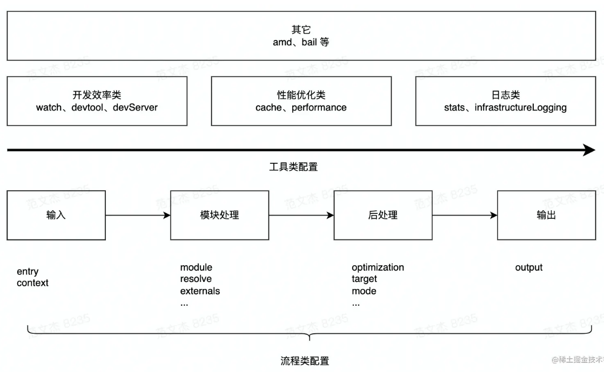

# Webpack

## Webpack小册笔记

Webpack 会忽略具体资源类型之间的差异，将所有代码/非代码文件都统一看作 Module —— 模块对象，以相同的加载、解析、依赖管理、优化、合并流程实现打包，并借助 Loader、Plugin 两种开放接口将资源差异处理逻辑转交由社区实现，实现统一资源构建模型，该种设计的优点：

- 所有资源都是Module，所以可以用一套代码实现诸多特性。eg：代码压缩，热更新，缓存等
- 打包时，资源与资源之间非常容易实现信息互换，例如可以轻易在 HTML 插入 Base64 格式的图片
- 借助 Loader，Webpack 几乎可以用任意方式处理任意类型的资源，例如可以用 Less、Stylus、Sass 等预编译 CSS 代码

### Webpack配置底层结构逻辑

1. Webpack编译流程
   1. 输入：从文件系统读入代码文件
   2. 模块递归处理：调用 Loader 转译 Module 内容，并将结果转换为 AST，从中分析出模块依赖关系，进一步递归调用模块处理过程，直到所有依赖文件都处理完毕；
   3. 后处理：所有模块递归处理完毕后开始执行后处理，包括模块合并，诸如运行时，产物优化等，最终输出Chunk集合
   4. 将Chunk写出到外部文件系统
   Webpack首先要根据输入配置（entry/context）找到项目入口文件；之后根据按模块处理（module/resolve/externals等）所配置的规则注意处理模块文件，处理过程包括转译，依赖分析等；模块处理完毕后，最后再根据后处理相关配置项（optimization/target等）合并模块资源，注入运行时依赖，优化产物结构等

2. 与打包流程强相关的配置项有：
  
     - 输入输出：
       
       - entry：用于定义项目入口文件，Webpack 会从这些入口文件开始按图索骥找出所有项目文件
       - context：项目执行上下文路径
       - output：配置产物输出路径、名称等

     - 模块处理：

       - resolve：用于配置模块路径解析规则，可用于帮助Webpack更精确，更高效的找到指定模块 
       - module：用于配置模块加载规则，例如针对什么类型的资源需要使用哪些 Loader 进行处理
  
          module.rules子属性则用于定义针对什么类型的文件使用哪些Loader处理
         - test：用于声明该规则的过滤条件，只有路径名命中该正则的文件才会应用这条规则
         - use：用于声明这条规则的Loader处理器序列，所有命中该规则的文件都会被传入Loader序列做转译处理
       - externals：用于声明外部资源，Webpack 会直接忽略这部分资源，跳过这些资源的解析、打包操作

     - 后处理：

       - optimization：用于控制如何优化产物包体积，内置Dead Code Elimination、Scope Hoisting、代码混淆、代码压缩等功能
       - target：用于配置编译产物的目标运行环境，支持web，node，eletron等值，不同值最终产物会有所差异
       - mode：编译模式短语，支持development，production等值，可以理解为一种声明环境的短语
3. webpack提供的一系列用于提升研发效率的工具

    - 开发效率类：

      - watch：用于配置持续监听文件变化，持续构建
      - devtool：用于配置产物Sourcemap生成规则
      - devServer：用于配置与HMR强相关的开发服务器功能
    - 性能优化类：

      - cache：Webpack 5 之后，该项用于控制如何缓存编译过程信息与编译结果
      - performance：用于配置当产物大小超过阈值时，如何通知开发者
    - 日志类：

      - stats：用于精确地控制编译过程的日志内容，在做比较细致的性能调试时非常有用
      - infrastructureLogging：用于控制日志输出方式，例如可以通过该配置将日志输出到磁盘文件
  


### 如何借助Babel+ts+eslint构建现代js工程环境
  
1. Babel是一个开源js转编译器，它能将高版本等价转译为向后兼容，能直接在旧版Js引擎运行的低版本代码
2. webpack场景下，只需使用babel-loader即可接入Babel转译功能.
3. @babel/preset-env是一种Babel预设规则集——Preset，这种设计能按需将一系列复杂、数量庞大的配置、插件、Polyfill 等打包成一个单一的资源包，从而简化 Babel 的应用、学习成本
   1. babel-preset-react：包含 React 常用插件的规则集，支持 preset-flow、syntax-jsx、transform-react-jsx 等；
   2. @babel/preset-typescript：用于转译 TypeScript 代码的规则集
   3. @babel/preset-flow：用于转译 [Flow](https://flow.org/en/docs/getting-started/) 代码的规则集


> 为什么不直接使用ts-loader？\
> babel-loader会忽略ts类型检查，能绕过整个转换操作变得更快。ts-loader用于将ts转换为js，babel-loader则用于根据我们的要求将该js转换为目标浏览器友好的代码版本

### 如何借助预处理器、postcss等构建现代css工程环境

1. 原生webpack并不能识别css语法，如果不做额外配置直接导入.css文件，会导致编译失败，所以我们在webpack中处理css文件需要用到：
   
   - css-loader：该 Loader 会将 CSS 等价翻译为形如 module.exports = "${css}" 的JavaScript 代码，使得 Webpack 能够如同处理 JS 代码一样解析 CSS 内容与资源依赖；
   - 该 Loader 将在产物中注入一系列 runtime 代码，这些代码会将 CSS 内容注入到页面的 \<style> 标签，使得样式生效；
   - mini-css-extract-plugin：该插件会将 CSS 代码抽离到单独的 .css 文件，并将文件通过 \<link> 标签方式插入到页面中（当webpack版本低于5.0时，需要使用extract-text-webpack-plugin）代替 mini-css-extract-plugin\
  **css-loader能让webpack正确的理解css代码，分析资源依赖；而style-loader、mini-css-extract-plugin能够通过适当方式将css插入到页面，对页面样式产生影响**
2. npx：npx是npm5.2.0版本新增的一个工具包。定义为npm包的执行者，相比于npm，npx会自动安装依赖包并执行某个命令。npx 会在当前目录下的./node_modules/.bin里去查找是否有可执行的命令，没有找到的话再从全局里查找是否有安装对应的模块($PATH)，全局也没有的话就会自动下载对应的模块。npx主要是想解决调用项目内部安装的模块
   
   - 利用npx可以执行某个版本的node运行脚本
      ```js
      $ npx node@0.12.8 -v