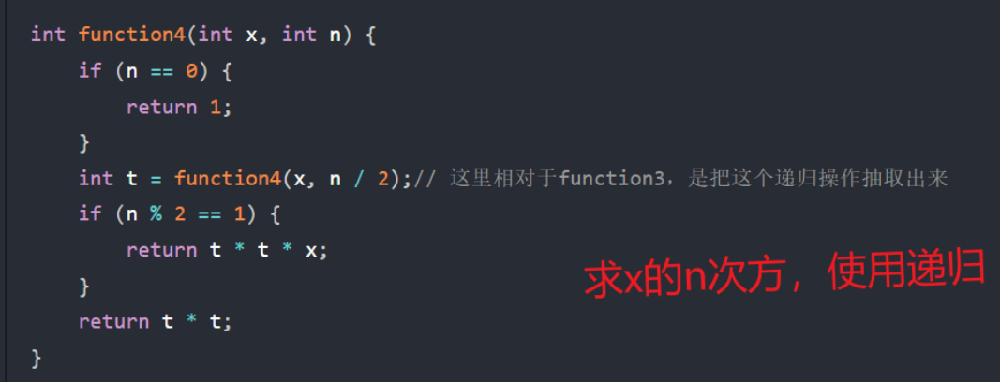
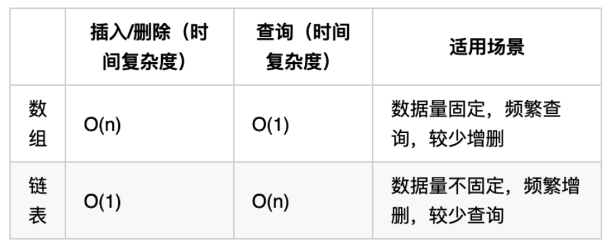
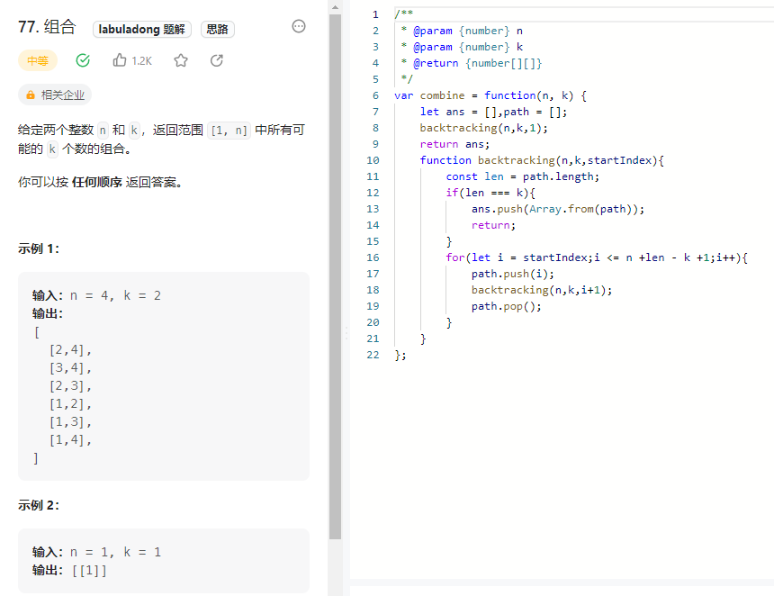

# 算法

## 时间复杂度&空间复杂度

时间复杂度：算法的时间复杂度，它反映的不是算法的逻辑代码到底被执行了多少次，而是随着输入规模的增大，算法对应的执行总次数的一个**变化趋势**

空间复杂度是对一个算法在运行过程中临时占用存储空间大小的量度。和时间复杂度相似，它是内存增长的**趋势**。

O(1)常数阶 < O(logn)对数阶 < O(n)线性阶 < O(n^2)平方阶 < O(n^3)立方阶 < O(2^n)指数阶



## 数组

数组是存放在连续内存空间上的相同类型数据的集合。

对于数组的遍历来说，for循环的速度大于map,forEach方法的速度,因为map,forEach不仅会进行遍历还会进行对元素的操作

[704. 二分查找 - 力扣（LeetCode）](https://leetcode.cn/problems/binary-search/)

[34. 在排序数组中查找元素的第一个和最后一个位置 - 力扣（LeetCode）](https://leetcode.cn/problems/find-first-and-last-position-of-element-in-sorted-array/description/?languageTags=javascript)

[69. x 的平方根  - 力扣（LeetCode）](https://leetcode.cn/problems/sqrtx/description/)

[367. 有效的完全平方数 - 力扣（LeetCode）](https://leetcode.cn/problems/valid-perfect-square/description/)

[977. 有序数组的平方 - 力扣（LeetCode）](https://leetcode.cn/problems/squares-of-a-sorted-array/description/)

[209. 长度最小的子数组 - 力扣（LeetCode）](https://leetcode.cn/problems/minimum-size-subarray-sum/description/?languageTags=javascript)

[904. 水果成篮 - 力扣（LeetCode）](https://leetcode.cn/problems/fruit-into-baskets/description/)

[螺旋矩阵 - 力扣（LeetCode）](https://leetcode.cn/problems/spiral-matrix-ii/description/)

> [while里面的内容什么时候用&#34;&lt;&#34; 什么时候用 &#34;&lt;=&#34;](https://www.cnblogs.com/lh4217/p/15945576.html#:~:text=在二分搜索中%2C如,分搜索就失效了。)
>
> - 当设置right = nums.length - 1时，需要用到<=， 因为整个搜索范围是个闭区间[left, right]， 当left==right时，区间是有效的。
> - 当设置right = nums.length时，需要用到<， 因为整个搜索范围是个左闭右开区间[left, right)

## 链表



[203. 移除链表元素 - 力扣（LeetCode）](https://leetcode.cn/problems/remove-linked-list-elements/)

[707. 设计链表 - 力扣（LeetCode）](https://leetcode.cn/problems/design-linked-list/description/)

[24. 两两交换链表中的节点 - 力扣（LeetCode）](https://leetcode.cn/problems/swap-nodes-in-pairs/description/)

> 删除链表中的节点的题需要找到需要删除的节点的前一个节点

[19. 删除链表的倒数第N个节点 - 力扣（leetcode）](https://leetcode.cn/problems/remove-nth-node-from-end-of-list/)

[链表相交 - 力扣（leetcode）](https://leetcode.cn/problems/intersection-of-two-linked-lists-lcci/description/)

[141. 环形链表 - 力扣（leetcode）](https://leetcode.cn/problems/linked-list-cycle/description/?languageTags=javascript)

# 哈希表

哈希表是根据关键码的值而直接进行访问的数据结构

一般哈希表都是用来快速判断一个元素是否出现在集合里

常见的三种哈希结构

- 数组
- set
- map

[242. 有效的字母异位词 -力扣（leetcode）](https://leetcode.cn/problems/valid-anagram/description/)

[308. 赎金信 - 力扣（leetcode）](https://leetcode.cn/problems/ransom-note/)

[349. 两个数组的交集 - 力扣（leetcode）](https://leetcode.cn/problems/intersection-of-two-arrays/)

[202.快乐数 - 力扣（leetcode)](https://leetcode.cn/problems/happy-number/description/?languageTags=javascript)

[1. 两数之和 - 力扣（leetcode）](https://leetcode.cn/problems/two-sum/description/)

## 字符串

[344.反转字符串 - 力扣（leetcode）](https://leetcode.cn/problems/reverse-string/description/)

[剑指offer 05.替换空格 - 力扣（leetcode）](https://leetcode.cn/problems/ti-huan-kong-ge-lcof/)

## 二叉树

链式存储的二叉树节点的定义方式

```js
function TreeNode(val, left, right) {
    this.val = (val === undefined ? 0 : val)
    this.left = (left === undefined ? null : left);
    this.right = (right === undefined ? null : right);
}
```

前序遍历
(递归)
```js
var pre = function (){
    let res = [];
    const dfs = function (root){
        if(root === null) return ;
        res.push(root.val);
        dfs(root.left);
        dfs(root.right); 
    }
    dfs(root);
    return res;
}
```
(迭代)
// 入栈 右 -> 左
// 出栈 中 -> 左 -> 右
```js
var preorderTraversal = function(root, res = []) {
    if(!root) return res;
    const stack = [root];
    let cur = null;
    while(stack.length) {
        cur = stack.pop();
        // 中右左
        res.push(cur.val);
        cur.right && stack.push(cur.right);
        cur.left && stack.push(cur.left);
    }
    return res;
};
```
中序遍历（迭代）
// 入栈 左 -> 右
// 出栈 左 -> 中 -> 右

```js
var inorderTraversal = function(root, res = []) {
    const stack = [];
    let cur = root;
    while(stack.length || cur) {
        if(cur) {
            stack.push(cur);
            // 左
            cur = cur.left;
        } else {
            // --> 弹出 中
            cur = stack.pop();
            res.push(cur.val); 
            // 右
            cur = cur.right;
        }
    };
    return res;
};
```
后序遍历（迭代）
// 入栈 左 -> 右
// 出栈 中 -> 右 -> 左 结果翻转
```js
var postorderTraversal = function(root, res = []) {
    if (!root) return res;
    const stack = [root];
    let cur = null;
    do {
        cur = stack.pop();
        res.push(cur.val);
        cur.left && stack.push(cur.left);
        cur.right && stack.push(cur.right);
    } while(stack.length);
    return res.reverse();
};
```


**递归的三个要素：**
**- 确定递归函数的参数和返回值**
**- 确定终止条件**
**- 确定单层递归的逻辑**


**二叉树的层序遍历**

```js
var levelOrder = function (root) {
    let res = [],
        quene = [];
    queue.push(root);
    if(root === null) return res;
    while(quene.length !== 0) {
        // 记录当前层级节点数
        let length = quene.length;
        // 存放每一层的节点
        let cueLevel = [];
        for(let i = 0; i < length; i++){
            // 获取第一个元素
            let node = quene.shift();
            curLevel.push(node.val);
            // 存放当前层下一层的节点
            node.left && quene.push(node.left);
            node.right && quene.push(node.right);
        } 
        res.push(curLevel);
    }
    return res;
 }
```


## 回溯算法

回溯法也可以叫做回溯搜索法，回溯是递归的副产品，只要有递归就会有回溯。回溯的本质是穷举，穷举所有可能，然后选出想要的答案

回溯法解决的问题：

- 组合问题：N个数里面按一定规则找出k个数的集合
- 切割问题：一个字符串按一定规则有几种切割方式
- 子集问题：一个N个数的集合里有多少符合条件的子集
- 排列问题：N个数按一定规则全排列，有几种排列方式
- 棋盘问题：N皇后，解数独等等

回溯法解决的问题都可以抽象为树形结构

回溯三部曲：

- 回溯函数模板返回值以及函数，回溯算法中函数返回值一般为void
- 回溯函数终止条件
- 回溯搜索的遍历过程

回溯算法的模板

```
void backtracking(参数) {
    if (终止条件) {
        存放结果;
        return;
    }

    for (选择：本层集合中元素（树中节点孩子的数量就是集合的大小）) {
        处理节点;
        backtracking(路径，选择列表); // 递归
        回溯，撤销处理结果
    }
}
```

[77. 组合 - 力扣（leetcode）](https://leetcode.cn/problems/combinations/description/)

[216. 组合总和 - 力扣（leetcode）](https://leetcode.cn/problems/combination-sum-iii/description/)

[17. 电话号码的字母组合 - 力扣（leetcode）](https://leetcode.cn/problems/letter-combinations-of-a-phone-number/)

[39. 组合总和 - 力扣（leetcode）](https://leetcode.cn/problems/combination-sum/)

[40. 组合总和ii - 力扣（leetcode）](https://leetcode.cn/problems/combination-sum-ii/)

[131. 分割回文串 - 力扣（leetcode）](https://leetcode.cn/problems/palindrome-partitioning/description/?languageTags=javascript)

## 贪心算法
1. 贪心的本质是选择每一阶段的局部最优，从而达到全局最优
2. 贪心一般解题步骤：
   
   1. 将问题分解为若干个问题
   2. 找出适合的贪心策略
   3. 求解每一个子问题的最优解
   4. 将局部最优解堆叠成全局最优解

[455. 分发饼干 - 力扣（leetcode）](https://leetcode.cn/problems/assign-cookies/)

[53. 最大子数组和 - 力扣（leetcode）](https://leetcode.cn/problems/maximum-subarray/description/)

## 动态规划

动态规划中每一个状态一定是由上一个状态推导出来的，**贪心没有状态推导，而是从局部选择最优的**

动态规划的解题步骤：

- 确定dp数组以及下标的含义
- 确定递推公式
- dp数组如何初始化
- 确定遍历顺序
- 举例推导dp数组